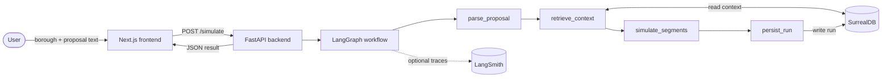
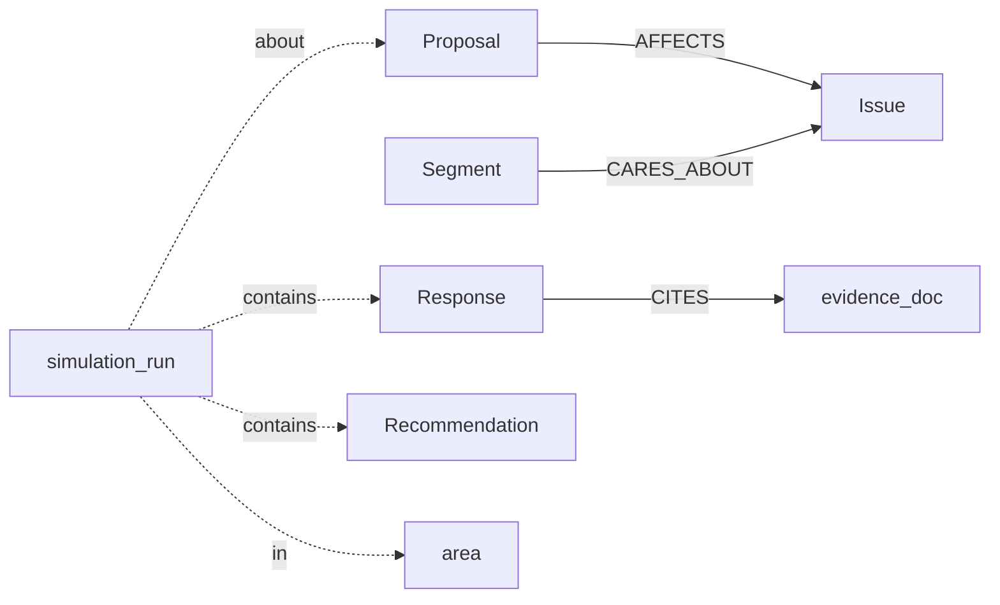

# BoroughSignal

**Author:** Ibrahim Malik

Synthetic audience copilot for London planning proposals.

BoroughSignal simulates how different audience segments may react to a planning proposal, using structured context, persistent state, and a LangGraph workflow backed by SurrealDB.

---

## Why This Matters

Planning proposals are often evaluated with fragmented context and shallow stakeholder assumptions. BoroughSignal helps teams explore how different local audience segments may respond to a proposal, why they respond that way, and how support may change after improving the proposal.

---

## What It Does

A user picks a London borough and enters a planning proposal. BoroughSignal parses the proposal, retrieves borough and audience context from SurrealDB, simulates how each audience segment would react, persists the run, and can generate an improved version of the proposal so the original and improved can be compared side by side. The pipeline is broken down step by step under [How It Works](#how-it-works).

---

## Stack

- **Frontend:** Next.js
- **Backend:** FastAPI
- **Workflow orchestration:** LangGraph
- **Observability:** LangSmith
- **Database:** SurrealDB
- **Containerisation:** Docker (for SurrealDB)

---

## Architecture

BoroughSignal uses a multi-step LangGraph workflow with persistent state in SurrealDB.

### Workflow



The four workflow nodes run in order. Each is wrapped with `@traceable`, so when `LANGSMITH_API_KEY` is set the entire pipeline appears as a single trace in LangSmith.

### Domain model



`AFFECTS`, `CARES_ABOUT`, `CITES`, `LIVES_IN`, and `BELONGS_TO` are SurrealDB `RELATE` edges. They make a single run explainable as a graph from proposal to evidence — see the worked example under [Graph traversal example](#graph-traversal-example).

### Module map

| Concept | File |
|---|---|
| FastAPI app, CORS, route includes, `/health` | `apps/api/main.py` |
| Four workflow nodes (`parse_proposal_node`, `retrieve_context_node`, `simulate_segments_node`, `persist_run_node`) | `apps/api/graph/nodes.py` |
| Extract structured proposal features from raw text | `apps/api/services/features.py` |
| Map features and keywords to a small issue taxonomy | `apps/api/services/issues.py` |
| Borough-vs-place mismatch detection (static `PLACE_TO_BOROUGH`) | `apps/api/services/geography.py` |
| Segment scoring, area issue modifiers, stance mapping, run confidence | `apps/api/services/scoring.py` |
| Build a single recommendation string from detected signals | `apps/api/services/recommendations.py` |
| Write proposal, run, responses, recommendation and `RELATE` edges into SurrealDB | `apps/api/services/persistence.py` |
| Typed client for `/lookups/bootstrap`, `/simulate`, `/simulate/compare`, `/runs/recent` | `apps/web/src/lib/api.ts` |
| Single-page UI: borough picker, proposal input, results panel, compare view | `apps/web/src/app/page.tsx` |

---

## Key Features

- Structured synthetic audience simulation
- Borough-aware proposal analysis
- Geography mismatch warnings for known place/borough inconsistencies
- Persistent run history
- Before/after proposal comparison
- LangSmith traces for workflow observability
- Sample scenarios for reliable demo flow

---

## Example Use Cases

- Test support for affordable housing proposals
- Explore how transport changes affect different segments
- Compare original vs improved proposal wording
- Inspect how borough context changes audience reactions

---

## Demo Scenarios

The app includes curated sample scenarios:

- Newham housing near Stratford
- Southwark tower block trade-off
- Hackney safer streets and shops
- Camden homes near King's Cross

---

## How It Works

### 1. Proposal Parsing

The backend extracts structured proposal features such as new homes, affordable housing, quantified affordability, station access, transport mitigation, limited parking, retail space, green space loss/gain, public realm improvements, safety measures, local character risk, and heritage-sensitive design.

### 2. Context Retrieval

The system retrieves the borough profile, audience segments, issue taxonomy, and evidence snippets.

### 3. Segment Simulation

Each segment is scored using issue priorities, borough-specific issue modifiers, proposal feature modifiers, and feature-specific bonuses and penalties.

### 4. Persistence

Each run stores the proposal text, extracted features, detected issues, recommendation, segment results, confidence and signal strength, and graph relationships to issues and evidence.

### 5. Comparison

The app generates an improved proposal version and reruns the simulation to show how scores and sentiment change.

---

## Output interpretation

BoroughSignal reports two different summary outputs: **overall sentiment** and **signal strength**.

### Overall sentiment

Overall sentiment is the aggregate direction of audience reaction: `support`, `mixed`, or `oppose`.

The system first assigns each audience segment a numeric score, then maps that score to a stance:

- `score >= 0.75` → `support`
- `0.50 <= score < 0.75` → `mixed`
- `score < 0.50` → `oppose`

These segment stances are then aggregated using:

- `support = +1`
- `mixed = 0`
- `oppose = -1`

If the total is:

- greater than `1` → overall sentiment = `support`
- less than `-1` → overall sentiment = `oppose`
- otherwise → overall sentiment = `mixed`

### Signal strength

Signal strength is a separate value in the range `0–1`. It is **not** a probability of support.

Instead, it reflects how much structured signal the system had for the analysis, based on factors such as:

- detected proposal features
- detected issues
- retrieved evidence
- geography consistency

This means a proposal can have **high signal strength** but still produce an **oppose** overall sentiment. In that case, the system is indicating that it found a strong structured basis for a negative result.

### Signal strength calculation

Signal strength is currently a heuristic score rather than a calibrated probability.

It is calculated from:

- a base score of `0.35`
- `+ 0.08 × number of detected issues`
- `+ 0.04 × number of active modeled features`
- `+ 0.03 × evidence count`
- `- 0.08` if a geography mismatch warning is triggered

The result is then clamped to the range `0.20–0.95` and rounded to 2 decimal places.

In practice, signal strength should be interpreted as a measure of **analysis richness and structured grounding**, not as a measure of whether a proposal is likely to be supported.

---

## Local Development

### Requirements

- Python 3
- Node.js / npm
- Docker
- LangSmith account and API key

### 1. Start SurrealDB

From the repo root:

```bash
mkdir -p surreal-data
sudo docker run --rm --pull always --name surrealdb \
  -p 8000:8000 \
  --user $(id -u) \
  -v "$(pwd)/surreal-data:/mydata" \
  -v "$(pwd)/db:/db:ro" \
  surrealdb/surrealdb:latest \
  start --log info --user root --pass root rocksdb:/mydata/boroughsignal.db
```

The `mkdir -p surreal-data` ensures the mounted data directory exists and is writable when the container runs as the current user (`--user $(id -u)`).

Leave this running in its own terminal. The extra `-v "$(pwd)/db:/db:ro"` mount makes `db/schema.surql` and `db/seed.surql` available to the in-container CLI in step 2.

### 2. Apply schema and seed (first time, or after wiping `surreal-data/`)

With the SurrealDB container running, from the repo root:

```bash
sudo docker exec surrealdb /surreal import \
  --endpoint http://localhost:8000 \
  --username root --password root \
  --namespace boroughsignal --database main \
  /db/schema.surql

sudo docker exec surrealdb /surreal import \
  --endpoint http://localhost:8000 \
  --username root --password root \
  --namespace boroughsignal --database main \
  /db/seed.surql
```

To start over with a clean database, stop the SurrealDB container (Ctrl-C in its terminal) and remove the on-disk data directory before redoing steps 1 and 2:

```bash
rm -rf surreal-data/
```

### 3. Configure backend environment

```bash
cp apps/api/.env.example apps/api/.env
```

Then edit `apps/api/.env` and fill in `LANGSMITH_API_KEY`. The defaults match the SurrealDB Docker command above.

### 4. Start the Backend

```bash
cd apps/api
python3 -m venv .venv                  # first time only
source .venv/bin/activate
pip install -r requirements.txt        # first time only
python3 -m uvicorn main:app --reload --port 8001
```

Smoke check: `curl http://127.0.0.1:8001/health` should return `{"status":"ok"}`, and `curl http://127.0.0.1:8001/lookups/bootstrap` should return non-empty boroughs and segments once the seed step above has been applied.

### 5. Start the Frontend

```bash
cd apps/web
npm install                            # first time only
npm run dev
```

The frontend reads `NEXT_PUBLIC_API_BASE_URL` (with a fallback to `http://127.0.0.1:8001`). To point at a different backend, copy `apps/web/.env.example` to `apps/web/.env.local` and edit it.

### Tests and checks

Backend tests (from `apps/api/` with the venv active):

```bash
pip install -r requirements-dev.txt    # first time only
python -m pytest tests/
```

Frontend lint and production build (from `apps/web/`):

```bash
npm run lint
npm run build
```

### Demo walkthrough

With SurrealDB, the backend, and the frontend all running per the steps above:

1. Open `http://localhost:3000`.
2. Pick a sample scenario (e.g. *Southwark tower block trade-off*) and click **Simulate**.
3. Review the result panel: detected issues, per-segment stance and rationale, cited evidence, and the recommendation.
4. Click **Compare before / after**. Observe how segment scores and overall signal shift between the original and improved proposals.
5. If `LANGSMITH_API_KEY` is set in `apps/api/.env`, open the LangSmith project to see the four workflow nodes for this run as a single trace.

For a longer narrative version, see `docs/demo-script.md`.

---

## Deployment

The simplest viable demo deployment path uses three managed services. Each piece is set up via its provider dashboard; no extra repo files are introduced.

- **Database:** Surreal Cloud (managed SurrealDB)
- **Backend:** Render Web Service (FastAPI)
- **Frontend:** Vercel (Next.js)

### 1. Database — Surreal Cloud

1. Create a managed SurrealDB instance on Surreal Cloud suitable for demo use. Pick a region close to the backend region you plan to use on Render.
2. Note the instance's connection URL (a `wss://...` endpoint) and the username/password it provides.
3. Apply the schema and seed from this repo against the cloud instance using the same import flow as local setup — only `--endpoint`, `--username`, and `--password` change:

   ```bash
   surreal import \
     --endpoint <surreal-cloud-url> \
     --username <surreal-cloud-username> --password <surreal-cloud-password> \
     --namespace boroughsignal --database main \
     db/schema.surql

   surreal import \
     --endpoint <surreal-cloud-url> \
     --username <surreal-cloud-username> --password <surreal-cloud-password> \
     --namespace boroughsignal --database main \
     db/seed.surql
   ```

   This is the same `surreal import` flow used in step 2 of local setup. The `OPTION IMPORT;` directive already present in `db/schema.surql` and `db/seed.surql` is required by SurrealDB 3.x's import endpoint.

### 2. Backend — Render Web Service

In the Render dashboard, create a new Web Service from this repo:

- **Root directory:** `apps/api`
- **Build command:** `pip install -r requirements.txt`
- **Start command:** `python3 -m uvicorn main:app --host 0.0.0.0 --port $PORT`

Set the following environment variables in the Render service settings.

Required:

| Key | Value |
|---|---|
| `SURREALDB_URL` | The `wss://...` URL from Surreal Cloud |
| `SURREALDB_USERNAME` | Surreal Cloud username |
| `SURREALDB_PASSWORD` | Surreal Cloud password |
| `SURREALDB_NAMESPACE` | `boroughsignal` |
| `SURREALDB_DATABASE` | `main` |

Optional (LangSmith tracing):

| Key | Value |
|---|---|
| `LANGSMITH_TRACING` | `true` |
| `LANGSMITH_API_KEY` | Your LangSmith key |
| `LANGSMITH_PROJECT` | `boroughsignal` |

After Render finishes building and starts the service, note the public URL it assigns (e.g. `https://boroughsignal-api.onrender.com`). That URL is what the frontend needs.

### 3. Frontend — Vercel

In the Vercel dashboard, import this repo as a new project:

- **Root directory:** `apps/web`

Set one environment variable:

| Key | Value |
|---|---|
| `NEXT_PUBLIC_API_BASE_URL` | The deployed Render backend URL (e.g. `https://boroughsignal-api.onrender.com`) |

Because `NEXT_PUBLIC_API_BASE_URL` is read at build time by Next.js, **redeploy the frontend any time the backend URL changes**.

### Smoke checks

After all three pieces are deployed:

```bash
curl https://<render-backend-url>/health
# → {"status":"ok"}

curl https://<render-backend-url>/lookups/bootstrap | head
# → non-empty areas, segments, issues
```

Then open the deployed Vercel URL in a browser and confirm, via DevTools → Network, that requests go to the deployed Render backend rather than `127.0.0.1`. Finally, run one end-to-end scenario in the UI (pick a borough, run a sample proposal) and confirm the result renders.

### Honest trade-offs

- Render free or low-cost plans may cold-start after idle, adding a few seconds to the first request after a quiet period.
- `/simulate` is synchronous and can take a few seconds to return — there is no background queue.
- CORS on the backend is permissive (`allow_origins=["*"]`) for demo simplicity.
- LangSmith tracing is optional. The app runs correctly without it; setting the LangSmith env vars only adds run traces.
- This path is intended as a credible demo deployment, not full production hardening (no auth, no rate limiting, no autoscaling tuning, no managed backups beyond what Surreal Cloud provides).

---

## Limitations

- This is a synthetic audience system, not real survey data
- Simulation logic is deterministic and parameterised; there is no LLM in the request path
- Geographic validation is currently lightweight and curated, not full GIS-based
- Proposal understanding is partly rule-based
- Segment behaviour is modelled, not learned from real labelled response data
- Current evidence retrieval is small and curated

---

## Why This Is a Good Fit for the Hackathon

BoroughSignal aligns with the LangChain × SurrealDB hackathon goals by demonstrating:

- LangGraph workflow orchestration
- Structured persistent memory in SurrealDB
- Graph-style relationships between proposals, issues, segments, and evidence
- Practical, real-world decision support
- Optional workflow tracing via LangSmith

---

## Future Work

- Richer retrieval from larger planning datasets
- Stronger place resolution and borough matching
- More expressive proposal parsing
- Learned calibration against real-world data
- Reusable open-source SurrealDB + LangGraph simulation components

---

## Naming Conventions

| Context | Value |
|---|---|
| Product name | `BoroughSignal` |
| GitHub repo | `borough-signal` |
| Internal/config slug | `boroughsignal` |

---

## Graph traversal example

BoroughSignal uses graph relationships in SurrealDB to explain how a proposal is connected to issues, segments, and evidence.

Example relationship path:

- `proposal -> AFFECTS -> issue`
- `segment -> CARES_ABOUT -> issue`
- `response -> CITES -> evidence_doc`

This lets the system explain not just the final result, but also the structured path behind it.

Example idea:

- proposal affects affordability and transport
- young renters care about affordability
- commuters care about transport
- responses cite evidence documents linked to those issues

---

## Licence

MIT Licence.